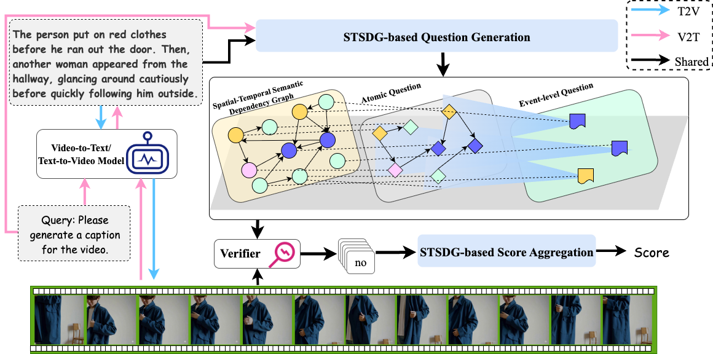

# FIFA


This is the official release accompanying our paper, [FIFA: Unified Faithfulness Evaluation Framework for Text-to-Video and Video-to-Text Generation
](https://arxiv.org/abs/2507.06523). FIFA will be available as a PIP package as well.

If you find FAITHSCORE useful, please cite:
```
@misc{jing2025fifaunifiedfaithfulnessevaluation,
      title={FIFA: Unified Faithfulness Evaluation Framework for Text-to-Video and Video-to-Text Generation}, 
      author={Liqiang Jing and Viet Lai and Seunghyun Yoon and Trung Bui and Xinya Du},
      year={2025},
      eprint={2507.06523},
      archivePrefix={arXiv},
      primaryClass={cs.CV},
      url={https://arxiv.org/abs/2507.06523}, 
}
```

## Process



## Install

1. Clone the repo
```
git clone https://github.com/du-nlp-lab/FIFA.git
cd FIFA/fifa
```
2. Install requirements
```
TO DO
```
3. See examples for your evaluation. The example is placed in fifa/evaluate.py.

### Step 1: define your llm
- If you want to use OpenAI LLMs
```
from llm_api import OpenaiLLM
llm = OpenaiLLM(model_name="gpt-4o", api_key=None, NUM_SECONDS_TO_SLEEP=10)
```

- If you want to use qwen
```
from llm_api import Qwen3LLM
llm = Qwen3LLM(model_name="Qwen/Qwen3-8B")
```


- If you want to use other LLMs, please rewrite BaseLLM in llm_api.py

### Step 2: Define your VideoQA model

- If you want to use InternVL2.5
```
from video_qa_internvl import InternVLGenerator
vqamodel = InternVLGenerator(model_name="OpenGVLab/InternVL2_5-8B")
```


- If you want to use qwen2.5-vl
```
from video_qa_qwen import Qwen25VLGenerator
vqamodel = Qwen25VLGenerator(model_name="Qwen/Qwen2.5-VL-32B-Instruct")
```

- If you want to use other VideoLLMs, please rewrite BaseVQAGenerator in videoqa.py

### Step 3: Finish your evaluation task

- Example for Text2Video.
```
from eval_text2video import eval_text2video
## SHOW for Data Format
data = [{"prompt": "text", "video_path": "xx.mp4"}, {"prompt": "text", "video_path": "xx.mp4"}]
eval_text2video(data, save=False, n_parallel_workers=1, cache_dir="./results",  llm=llm, vqamodel=vqamodel)
```

- Example for Video2Text
```
from eval_video2text import eval_video2text
## SHOW for Data Format
data = [{"prompt": "text", "video_path": "xx.mp4", "question": "question"}, {"prompt": "text", "video_path": "xx.mp4", "question": "question"}]
eval_video2text(data, save=False, n_parallel_workers=1, cache_dir="./results", llm=llm, vqamodel=model)
```


## Running FIFA using Pip Package
TO DO

## Running FaithScore using a Command Line
You can also evaluate answers generated by the following command line.

TODO

## Data
### Annotation Data
The data is given in a json format file. For example, 


You can download our [annotation dataset]().


### Automatic Evaluation Benchmarks
You can download our [automatic evaluation benchmarks]().

## Leaderboard
TODO
